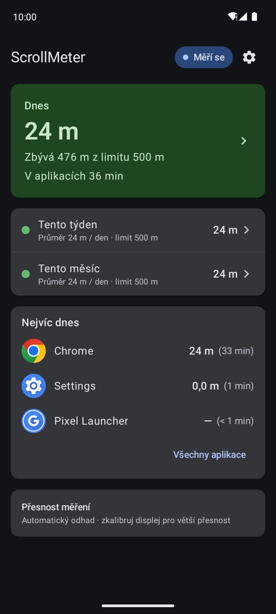
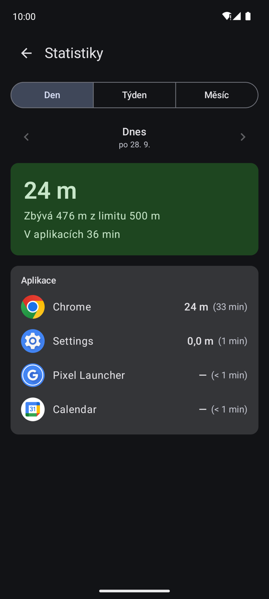
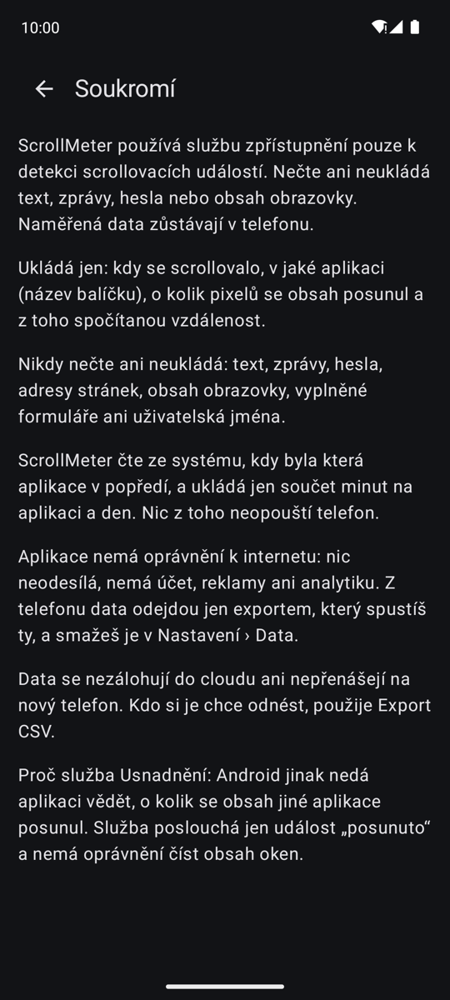

<div align="center">

# ScrollMeter

### Kolik toho denně nascrolluješ?

Screen time ti řekne, jak dlouho. ScrollMeter ti ukáže, jak daleko.
Každé posunutí feedu, článku nebo seznamu sečte a převede na metry a kilometry.

**Zadarmo · bez reklam · bez účtu · bez internetu · Android 10+**

[**⬇️ Stáhnout aplikaci**](../../releases/latest) · [Jak ji nainstalovat](#jak-ji-nainstalovat-za-tři-minuty) · [Jaká oprávnění chce](#jaká-oprávnění-potřebuje) · [Je to bezpečné?](#je-to-bezpečné)

</div>

---

## Ve zkratce

- 📏 **Měří vzdálenost scrollování** ve všech aplikacích a ukáže ji v metrech: dnes, za týden, za měsíc.
- 📴 **Nemá přístup k internetu.** Nemůže nic odeslat, ani kdyby chtěla. Všechno zůstává v telefonu.
- 🙈 **Nečte, co je na obrazovce.** Dozví se jen „v aplikaci X se obsah posunul o tolik pixelů". Žádné texty, zprávy ani hesla.
- 👤 **Žádný účet, žádné reklamy, žádná analytika.** Nikdo kromě tebe neví, že ji používáš.
- 🔓 **Celý kód je veřejný** tady v repozitáři, kdokoliv si může ověřit, co dělá.

## Co uvidíš

<table>
<tr>
<td width="33%"></td>
<td width="33%"></td>
<td width="33%"></td>
</tr>
<tr>
<td align="center"><b>Přehled</b><br>dnes proti dennímu limitu</td>
<td align="center"><b>Statistiky</b><br>den, týden, měsíc, po aplikacích</td>
<td align="center"><b>Soukromí</b><br>co čte a co nikdy</td>
</tr>
</table>

## Co umí

📊 **Dnes, tento týden, tento měsíc.** Karta *Dnes* ukazuje vzdálenost proti dennímu limitu, který si
nastavíš sám: zelená, od 70 % oranžová, nad limitem červená. A vždycky i slovy, třeba „Zbývá 80 m z limitu 500 m".

📱 **Po aplikacích.** Kolik metrů v Instagramu, kolik v prohlížeči, kolik ve zprávách. Volitelně i kolik
času v každé aplikaci trávíš: „Instagram 1,21 km (3 h 40 min)".

🏃 **Srovnání, ať si to představíš.** „To je přibližně délka jednoho běžeckého okruhu." Není to soutěž,
žádné rekordy ani odznaky. Jen číslo, které ti řekne víc než minuty.

📐 **Kalibrace platební kartou.** Přiložíš kartu k displeji, posuneš čáru na její okraj a měření sedí
na milimetr tvého konkrétního telefonu. Bez kalibrace se použije odhad podle údajů displeje.

🔔 **Dvě volitelná oznámení.** Když překročíš denní limit, a ráno shrnutí včerejška. Každé nejvýš jednou
denně, obě jsou ve výchozím stavu vypnutá.

📤 **Export do CSV a smazání jedním tlačítkem.** Data si můžeš kdykoliv vzít do tabulky, nebo je všechna smazat.

🇨🇿 🇬🇧 **Česky i anglicky**, podle jazyka telefonu.

## Co to nedělá

- ❌ **Neblokuje aplikace a nic ti nezakazuje.** Jen měří a ukazuje. Limit je informace, ne zámek.
- ❌ **Není to rodičovská kontrola.** Nikomu nic nehlásí, data neopustí telefon, na kterém je nainstalovaná.
- ❌ **Nečte obsah obrazovky.** Neví, co čteš, co píšeš, komu, ani na jaké stránce jsi.
- ❌ **Neměří dráhu prstu.** Měří, o kolik se posunul obsah. Po švihnutí prstem obsah ještě dojede,
  takže vzdálenost bývá delší než pohyb prstu. To je záměr: měří se, kolik obsahu ti projelo před očima.
- ❌ **Neměří všude.** Některé aplikace systému scrollování nehlásí, typicky **YouTube**. V nich ScrollMeter
  nenaměří nic a přizná to. Čas v aplikaci (když ho povolíš) se u nich ukáže i tak.
- ❌ **Nezálohuje se do cloudu** a data se nepřenesou na nový telefon. Kdo si je chce odnést, použije export.

---

## Jak ji nainstalovat (za tři minuty)

Aplikace **není v Google Play**, instaluje se ze souboru. Zní to hůř, než to je.
Potřebuješ **Android 10 nebo novější**.

**1.** V telefonu otevři [**stránku ke stažení**](../../releases/latest) a klepni na soubor
`scrollmeter-….apk` (ten s koncovkou `.apk`, ne `.aab`).

**2.** Telefon se zeptá, jestli soubor stáhnout → **Stáhnout**.

**3.** Otevři stažený soubor, z lišty oznámení nebo v aplikaci *Soubory* → *Stažené*.

**4.** Android řekne, že z tohohle zdroje instalovat nesmí. Klepni na **Nastavení**, zapni
**Povolit z tohoto zdroje** a vrať se zpátky.

**5.** **Instalovat** → **Otevřít**.

**6.** Aplikace tě provede úvodem. Na obrazovce *Povolit měření scrollování* si přečti, co bude číst a co ne,
a klepni na **Rozumím a chci pokračovat** → **Otevřít nastavení zpřístupnění**.

**7.** V nastavení najdi **ScrollMeter** (bývá v části *Stažené aplikace* nebo *Nainstalované aplikace*)
a zapni ho. Android ukáže obecné varování, co všechno služby Usnadnění *smějí*. ScrollMeter z toho
používá jen jedinou věc, viz [oprávnění](#jaká-oprávnění-potřebuje). Potvrď a vrať se do aplikace.

> **Napsal Android „Omezené nastavení"?** Na Androidu 13 a novějším to je normální u každé aplikace
> nainstalované mimo obchod. Otevři **Nastavení → Aplikace → ScrollMeter**, vpravo nahoře klepni na **⋮**
> a zvol **Povolit omezená nastavení**. Pak krok 7 zopakuj. Aplikace na to má přímo tlačítko
> *Otevřít informace o aplikaci*.

**8.** Kalibrace: klepni na **Zkalibrovat platební kartou** (asi minuta), nebo **Použít automatický odhad**.
Kalibrovat jde kdykoliv později.

**9.** Volitelně povol **Čas v aplikacích**. Bez toho aplikace měří dál, jen neuvidíš minuty.

Hotovo. Teď normálně používej telefon a za chvíli se do ScrollMeteru podívej.

> **Aplikace se sama neaktualizuje.** Nemá přístup k internetu, takže se ani nedozví, že vyšla nová verze.
> **Každou novou verzi si stáhneš a nainstaluješ ručně**, stejným postupem jako tuhle první. Naměřená data
> i nastavení zůstanou. Kdo to nechce hlídat, přidá si tenhle repozitář do
> [Obtainium](https://github.com/ImranR98/Obtainium) a o aktualizacích se dozví sám.

> **Google Play Protect** může u ručně instalované aplikace zobrazit varování. To je standardní hláška
> u všeho mimo obchod, ne nález něčeho škodlivého.

---

## Jaká oprávnění potřebuje

| Oprávnění | Povinné? | K čemu | Co z něj aplikace dostane |
|---|---|---|---|
| **Služba Usnadnění** (Zpřístupnění) | **ano** | Jediný způsob, jak se aplikace dozví o scrollování v *jiných* aplikacích. | Jen událost „obsah se posunul": v jaké aplikaci, kdy a o kolik pixelů. Nic víc. |
| **Přístup k údajům o využití** | ne | Čas strávený v jednotlivých aplikacích. | Kdy byla která aplikace na popředí. Ukládá se jen součet minut na aplikaci a den. |
| **Oznámení** | ne | Upozornění na překročený limit a ranní shrnutí. | Nic, jen smí poslat oznámení. Ptá se, až když oznámení zapneš. |

**Co aplikace nechce a nemá:** přístup k **internetu**, polohu, kontakty, fotky a soubory, mikrofon,
kameru, seznam všech nainstalovaných aplikací, kreslení přes jiné aplikace, běh na popředí.

### Proč Usnadnění a proč se ho nebát

Usnadnění je silné oprávnění. Obecně umí číst obrazovku a ovládat telefon, a proto Android u každé
aplikace, která ho chce, ukáže stejné strašidelné varování. **Co konkrétní aplikace z Usnadnění skutečně
dostane, ale určuje její konfigurace**, a ta je u ScrollMeteru nastavená na minimum:

- odebírá **jediný typ události**, „obsah se posunul" (`typeViewScrolled`),
- má výslovně **zakázáno číst obsah oken** (`canRetrieveWindowContent="false"`), takže text obrazovky
  nedostane, ani kdyby o něj požádala,
- neovládá telefon, neklepe za tebe, nesleduje dotyky.

Tuhle konfiguraci najdeš v souboru
[`accessibility_service_config.xml`](app/src/main/res/xml/accessibility_service_config.xml) a hlídají ji
automatické testy, které při jakémkoli rozšíření oprávnění selžou.

---

## Je to bezpečné?

### ✅ Proč tomu můžeš věřit

- **Bez internetu nejde nic poslat.** Aplikace nemá oprávnění `INTERNET`. To není slib v podmínkách
  použití, to je technická nemožnost: Android jí síť vůbec nepustí. V *Nastavení → Aplikace → ScrollMeter →
  Mobilní data* uvidíš 0 B.
- **Neví, co čteš.** Ukládá jen čas, název balíčku aplikace (např. `com.instagram.android`), počet
  posunutých pixelů a spočítanou vzdálenost. Nikdy text, zprávy, hesla, adresy stránek ani vyplněné formuláře.
- **Žádné cizí knihovny na sledování.** Žádná analytika, reklamní SDK, crash reporting ani Google Play Services.
- **Data jsou jen tvoje.** Vypnutá záloha do cloudu, z telefonu odejdou jen exportem, který spustíš ty.
  *Nastavení → Data → Smazat všechna data* je smaže, odinstalace taky.
- **Otevřený kód.** Všechno, co aplikace dělá, je tady v repozitáři. Kdo nechce věřit mně, přeloží si ji
  ze zdrojáku sám ([návod pro vývojáře](docs/development.md)).
- **Podepsané APK.** Každá verze je podepsaná stejným klíčem. Otisk certifikátu (SHA-256):
  ```
  04:6F:8C:D0:B0:73:23:F7:07:12:E1:12:53:CA:D7:FB:82:03:F2:68:C8:D8:10:53:78:3D:9C:1A:66:9C:0E:88
  ```
  Ověříš ho příkazem `apksigner verify --print-certs scrollmeter-….apk`. Otisky souborů jsou
  v `SHA256SUMS` u každé verze.

### ⚠️ Na co si dát pozor

- **Usnadnění dávej jen aplikacím, kterým věříš.** To platí obecně, ne jen tady. Podvodné aplikace
  ho zneužívají ke čtení obrazovky. Tahle aplikace z něj bere jen scrollování (viz výše), ale stahuj ji
  **jen z téhle stránky**, ne z přeposlaných souborů nebo cizích webů.
- **Co naměří, ukazuje o tobě dost.** Z čísel je vidět, které aplikace používáš a jak moc. V telefonu jsou
  v bezpečí, ale kdo má tvůj odemčený telefon, uvidí je taky. A exportované CSV už je obyčejný soubor:
  kam ho pošleš, tam je.
- **Není to ověřený obchod.** Tuhle aplikaci nikdo cizí nekontroloval, žádný Google ani nezávislý audit.
  Tvoje jistota je otevřený kód a to, že nemá internet.
- **Od roku 2027 může Google zpřísnit** instalaci aplikací mimo obchod na certifikovaných telefonech.
  V Česku zatím platí postup výše beze změny.

---

## Co zatím neumí

- **YouTube a některé další aplikace neměří**, protože scrollování systému nehlásí. Týká se to i části
  moderních aplikací postavených na nových seznamech v Jetpack Compose.
- **Přesnost je odhad.** Bez kalibrace se spoléhá na to, co o sobě hlásí displej, a to se u některých
  telefonů o pár procent liší. Kalibrace kartou to srovná.
- **Některé telefony měření uspávají.** Hlavně OnePlus / Oppo / Realme (ColorOS) umí službu na pozadí
  zabít, když dochází paměť. Aplikace to pozná a na přehledu ukáže červený pruh s tlačítkem *Zapnout měření*.
  Zkusit můžeš vypnout pro ScrollMeter optimalizaci baterie; že to pomůže na každém telefonu, zatím ověřené není.
- **Vynucené zastavení vypne měření.** Když ScrollMeter v nastavení aplikací *vynuceně zastavíš*, Android mu
  Usnadnění vypne a je potřeba ho zapnout znovu.
- **Jen jeden telefon.** Nic se nesynchronizuje, každý telefon měří sám za sebe.

---

## Je to open source

Tohle je koníček, ne produkt. Vznikl pro rodinu a vyvíjím ho, **jak mám čas a chuť**, bez roadmapy a bez termínů.

Celý kód je venku pod **[GPL-3.0](LICENSE)**. Kdokoliv si ho může vzít, upravit, opravit nebo v projektu
pokračovat po svém. Licence hlídá jedinou věc: odvozená verze zůstane taky otevřená.

- 🐛 **Chyba nebo nápad?** → [issue](../../issues)
- 🔧 **Chceš přispět kódem?** → pull requesty vítám, testy prosím taky
- 🍴 **Chceš to forknout?** → posluž si

### Autor

**Honza Hubka** — [honzahubka.cz](https://honzahubka.cz) · [LinkedIn](https://www.linkedin.com/in/honzahubka/)

## Pro vývojáře

Kotlin + Jetpack Compose, Room, DataStore. minSdk 29, compileSdk 36, žádné Google Play Services, žádná síť.

```bash
./gradlew assembleDebug        # APK v app/build/outputs/apk/debug/
./gradlew testDebugUnitTest    # unit testy
./gradlew lintDebug            # Android lint
```

Potřebuješ **JDK 21** a Android SDK s platformou 36. Build, podepsaný release, testovací protokoly
a měření přesnosti popisuje [`docs/development.md`](docs/development.md).

| Dokument | O čem je |
|---|---|
| [`docs/development.md`](docs/development.md) | build, release, ruční testy, kalibrace, uložená data |
| [`docs/SPEC.md`](docs/SPEC.md) | produktová a technická specifikace |
| [`docs/measurement-model.md`](docs/measurement-model.md) | co je vzdálenost scrollování, vzorce, kalibrace |
| [`docs/accessibility-policy.md`](docs/accessibility-policy.md) | co z Usnadnění používáme a co nikdy nečteme |
| [`docs/architecture.md`](docs/architecture.md) | tok událostí, balíčky, vlákna, datový model |
| [`docs/measurement-decisions.md`](docs/measurement-decisions.md) | záznam rozhodnutí (ADR) |
| [`handoff.md`](handoff.md) | živý stav prací a otevřené body |
